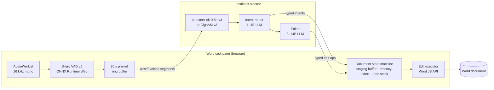

# Feasibility Report: A Russian-Language Voice Auto-Writer for Microsoft Word

**Status:** research, no implementation
**Date:** September 2026
**Question:** what does it take to build a document extension that listens
continuously and acts as a *smart auto-writer* — not a dictation transcriber?

---

## 1. Executive summary

**The verdict: buildable, on Word on the web, with a local model sidecar.** No
part of it is blocked by a missing capability. The hard parts are not the speech
recognition — they are the *policy* layers: deciding what counts as writing
versus thinking aloud, and executing spoken corrections against text the user
has already produced.

| # | Criterion | Verdict | What makes it work |
|---|-----------|---------|--------------------|
| 1 | Always listening | **Viable** | Mic in the Word-on-the-web task pane via `Office.devicePermission`; Silero VAD gates the stream |
| 2 | Thinking aloud isn't written | **Viable, hardest UX problem** | Staging buffer + hold-back window + an ASIDE intent class |
| 3 | Spoken edits are executed | **Viable, most engineering** | Recency index + typed edit ops + whole-sentence regeneration |
| 4 | Noise/commands never leak | **Viable with caveats** | Five filter layers; residual risk is a command misread as dictation |
| 5 | Resume after a pause | **Viable, extra work when local** | Open-sentence state + LLM stitching; local ASR has no semantic end-of-turn, so endpointing is hand-built |

**Three things that are genuinely hard**, in order:

1. **The commit decision (AC2).** Everything else is engineering; this is
   product design. A system that writes too eagerly is worse than useless, and
   one that writes too reluctantly is just a notepad. The design here is a
   *staging buffer with a hold-back window* — and that same buffer turns out to
   be what makes self-correction (AC3) cheap.
2. **Russian morphology in edits (AC3/AC5).** Replacing a word in Russian is
   not a substring swap. «Она была феей» → «Она была ведьмой» changes the
   inflection of the noun; other edits change agreement across the clause. The
   model must regenerate whole sentences, never patch words.
3. **Endpointing without a cloud model (AC5).** Cloud providers ship
   *semantic* end-of-turn detection. Local ASR does not, so distinguishing "I
   have finished my sentence" from "I am thinking mid-sentence" has to be built:
   silence duration plus a syntactic-completeness check from a small LLM.

**Cost story:** with local models, per-hour API spend is zero. The cost moves to
hardware — the floor is set by running ASR and an 8–14B LLM concurrently. All
recommended models are permissively licensed (GigaAM is MIT; parakeet-tdt-0.6b-v3
is CC-BY-4.0), so commercial distribution is not blocked.

---

## 2. Scope

- **Host: Microsoft Word on the web.** Google Docs was investigated and ruled
  out — its add-on surfaces cannot obtain the microphone at all, so criterion 1
  is unreachable there. It is not discussed further.
- **Language: Russian**, input and output, as a hard requirement. English is
  assumed to work as a side effect of the multilingual models chosen.
- **Local-first.** Models run on the user's machine via a localhost sidecar.
  Cloud is documented once, in §4.4, as an escape hatch.

---

## 3. Host platform: Word on the web

### 3.1 Microphone access — solved, with conditions

An Office add-in task pane can get the microphone through the
[Device Permission API](https://learn.microsoft.com/en-us/javascript/api/office/office.devicepermission):

```js
if (Office.context.platform === Office.PlatformType.OfficeOnline) {
  await Office.devicePermission.requestPermissions([
    Office.DevicePermissionType.microphone
  ]);
  // On a first-time grant the promise resolves true and you MUST reload
  // before getUserMedia will work: location.reload()
}
```

This shows a native **Allow / Allow once / Deny** dialog, after which
`navigator.mediaDevices.getUserMedia({ audio: true })` works inside the pane.

Conditions that shape the product:

- **`DevicePermission 1.1` is supported in Word, Excel and PowerPoint *on the
  web*, on Chromium-based browsers only.** Not Firefox, not Safari.
- **A first-time grant requires an add-in reload** before the capability is
  usable. This is documented behaviour, not a bug, and the onboarding flow has
  to absorb it.
- **Permission is sticky in an awkward way.** "Allow" persists until the add-in
  is uninstalled or the browser cache is cleared — a user who wants to revoke
  microphone access has no in-product path. This needs to be stated plainly in
  onboarding, and paired with a visible, always-available hard-mute in the pane.
- There is an [open issue](https://github.com/OfficeDev/office-js/issues/5726)
  where microphone access is lost after a tab refresh despite a granted
  permission, with a `microphone is not allowed in this document` policy
  violation in the console; clearing the browser cache fixes it temporarily. It
  was reported against a *sideloaded* add-in in **PowerPoint** on the web, not
  Word — same Office.js permission plumbing, so treat it as adjacent evidence and
  verify against Word during the spike in §10.

### 3.2 Word desktop cannot do this — today

The authoritative statement is in the API documentation itself: `DevicePermission
1.1` is supported in **Word, Excel and PowerPoint on the web** (plus new Outlook
on Windows), and calling `requestPermissions` on any other platform returns an
error. There is no desktop equivalent.

The underlying reason is that Office hosts add-ins in WebView2, and WebView2
requires the **host application** to respond to permission requests — Office does
not. Corroborating field report from
[office-js #933](https://github.com/OfficeDev/office-js/issues/933) (an Outlook
thread): *"There is a pop-up to ask for microphone permission on web, but nothing
happened on desktop app, so I can't access to microphone on desktop."*

Because a localhost sidecar is part of this design anyway, desktop is reachable
later by a different route: let the **sidecar own the microphone natively** and
have the task pane consume text rather than audio. That is a phase-4 item (§10),
not something to design around now.

### 3.3 The editing API is sufficient

`WordApi 1.9` is generally available on the web. The primitives needed are all
present and mostly date back to 1.1–1.3:

| Need | API |
|------|-----|
| Where is the caret | `context.document.getSelection()` |
| Find text to edit | `Range.search(text, options)` — supports wildcards |
| Replace text | `Range.insertText(newText, Word.InsertLocation.replace)` |
| Delete text | `Range.delete()` |
| Stable anchors | Content controls (`Range.insertContentControl()`) |
| Show edits as diffs | Change tracking (`WordApi 1.4` / `1.6`) |

Three constraints materially shape §6:

1. **`Range.search()` is capped at 255–256 characters**, and wildcard
   quantifiers cap at `{255}`. Long literal targets must be chunked: search on a
   distinctive leading fragment, then expand the range.
2. **Matches fail across partially-covered hyperlinks and cross-references.**
   Target resolution needs a fallback path when search returns nothing.
3. **Add-ins get no usable undo API.** Word's own undo stack is not exposed, and
   add-in edits do not reliably participate in it. Every applied operation must
   store its own inverse. This is not optional — a voice editor without undo is
   not shippable.

---

## 4. Model selection for Russian

### 4.1 Speech recognition

Russian-specific training matters more than model size here. A
[published CPU comparison](https://habr.com/ru/articles/1002260/) puts GigaAM at
**3.3% WER on Russian against Whisper large-v3 at 7.9%** — a specialist beating a
much larger generalist, on CPU.

| Model | Russian WER | Licence | Timestamps | Streaming | Notes |
|-------|------------|---------|-----------|-----------|-------|
| **GigaAM v3** (Salute/Sber) | ~3.3% (v3 lineage, CPU) | MIT | via RNN-T alignment | chunked | Best Russian quality; v3 adds **punctuation and text normalisation** — significant, it removes a whole post-processing stage |
| **parakeet-tdt-0.6b-v3** (NVIDIA) | competitive | CC-BY-4.0 | **word + segment + char level** | **yes**, dedicated streaming script (2 s chunk, 10 s left / 2 s right context) | 25 European languages incl. Russian and Ukrainian, auto language detection, ~2 GB RAM floor |
| whisper-large-v3-turbo | ~7.9% | MIT | segment level | via chunking | The generalist default; weaker on Russian |
| Vosk-model-ru-0.42 | highest of the four | Apache-2.0 | word level | yes | Lowest resource floor; use only if the hardware floor must drop |

**Recommendation: parakeet-tdt-0.6b-v3 as the primary, GigaAM v3 as the quality
option.** The reasoning is not WER alone — it is that parakeet ships **word-level
timestamps and a real streaming mode**, and §6 depends on both. Word timestamps
are what let a correction be anchored to the exact span the user just spoke,
rather than to a fuzzy text match. GigaAM v3 is the better choice for a
Russian-only product where accuracy dominates and its punctuation output can be
taken directly.

If both are viable on the target hardware, run parakeet for the live stream and
GigaAM as an optional higher-accuracy re-transcription of committed text.

### 4.2 Voice activity detection

[`@ricky0123/vad-web`](https://docs.vad.ricky0123.com/user-guide/browser/) runs
**Silero VAD v5** through ONNX Runtime Web in an AudioWorklet at 16 kHz, entirely
in the task pane. Running it browser-side rather than in the sidecar is a
deliberate choice: silence, typing and room noise never leave the page, which
cuts sidecar load and is the honest answer to "what is being transmitted".

### 4.3 Language models

Two models, two jobs, because the latency requirements differ by an order of
magnitude:

| Role | Requirement | Candidates |
|------|-------------|-----------|
| **Intent router** — classify each utterance as DICTATION / COMMAND / CORRECTION / ASIDE / NOISE | 100–300 ms, called on *every* utterance | Vikhr-Llama-3.2-1B (Russian-adapted tokenizer, ~5× more efficient than its base), Qwen3-4B |
| **Editor** — generate edit ops, regenerate sentences, stitch fragments | 500 ms–2 s, called only on edits and stitches | Qwen3-8B/14B, T-lite-it-1.0, T-pro-it-1.0 |

On Russian specifically, [Vikhr](https://arxiv.org/abs/2405.13929) is
purpose-built (adapted vocabulary, continued pretraining, instruction tuning) and
the **T-Tech T-lite / T-pro** models score at the top of the
[Russian LLM arena](https://github.com/VikhrModels/ru_llm_arena). Qwen3 is the
pragmatic default: strong Russian, wide size range, runs anywhere.

Serve through **Ollama** (OpenAI-compatible API, trivial model management) for
v1; move to vLLM only if throughput becomes a problem, which for a single-user
dictation tool it will not.

**Hardware floor is set by concurrency,** not by any single model: ASR and an
8–14B LLM must be resident simultaneously.

- **Minimum:** 16 GB RAM, CPU-only — parakeet (~2 GB) + a 4B router. Editor
  operations will be noticeably slow (seconds), which is survivable because they
  are not on the dictation hot path.
- **Comfortable:** a GPU with 12–16 GB VRAM, or Apple Silicon with 24 GB+
  unified memory — parakeet + 1B router + 8–14B editor, all resident.

### 4.4 The cloud escape hatch

Documented for completeness, not recommended. No provider offers a genuinely
free-forever *streaming* Russian tier. Groq's Whisper free tier (~2,000
requests/day, ~28,800 audio-seconds/day) is batch-only, so it needs VAD chunking
and yields ~1–2 s latency. Deepgram gives a one-time $200 credit and its **Flux**
model has the best turn detection available anywhere — a fused
transcription/end-of-turn model with median EOT under 300 ms — which would make
AC5 substantially easier; whether Russian is covered by Flux Multilingual needs
checking, as Flux launched English-only. Both send the user's audio, and the LLM
layer would send document context, off the machine. Given the privacy story is
this product's main differentiator against Word's built-in Dictate, going cloud
gives up the thing worth selling.

---

## 5. Architecture



The split is deliberate: **the pane owns the document and all state; the sidecar
owns the models and is stateless.** The sidecar never touches the document, which
means it can be restarted, swapped, or run a different model without any risk to
the user's text.

### 5.1 Reaching the sidecar — the one real plumbing risk

The task pane is served over HTTPS. Getting from there to a process on localhost
is not free, and this is the most likely thing to derail an implementation:

- **Mixed content blocks `ws://localhost` from an HTTPS page.** The Chromium
  request to treat loopback as secure for WebSockets
  ([issue 40386732](https://issues.chromium.org/issues/40386732)) is
  long-standing and unresolved.
- **Local Network Access** ([Chrome 138 flag, permission prompt in Chrome
  142](https://developer.chrome.com/blog/local-network-access)) does cover
  loopback destinations, and carries a mixed-content exemption for private IP
  literals, `.local` domains and the `targetAddressSpace` fetch option. But
  **WebSockets, WebTransport and WebRTC are explicitly not yet gated on the LNA
  permission**, so `ws://localhost` behaviour from HTTPS is version-dependent and
  should not be built on.
- **A plain self-signed certificate does not rescue this.** Browsers reject
  `wss://` to an untrusted certificate *silently* — there is no click-through
  dialog as there is for page loads.

**Recommended: the sidecar serves `wss://` with a locally-trusted CA installed by
its installer** — the [mkcert](https://github.com/FiloSottile/mkcert) pattern,
where a local CA goes into the system trust store and signs a certificate for
`localhost`/`127.0.0.1`. The alternative, if installing a CA is unacceptable, is
the Plex `*.plex.direct` trick: a public DNS name that resolves to 127.0.0.1 with
a real publicly-trusted certificate, at the cost of shipping a private key.

Re-check the LNA WebSocket timeline before building — it may simplify this.

### 5.2 Latency budget

The target is **under ~1 second** from end of speech to text on screen. Beyond
that, dictation stops feeling like writing.

| Stage | Budget | Notes |
|-------|--------|-------|
| VAD endpoint decision | ~200 ms | Trailing-silence threshold; tunable, and directly trades against AC5 |
| `wss://` round trip to sidecar | ~10 ms | Loopback |
| ASR (parakeet, streaming) | 200–500 ms | On a ~5 s utterance |
| Intent router (1–4B) | 100–300 ms | Every utterance — this is the hot path |
| Word API write | 100–200 ms | `Word.run` context sync |
| **Total (dictation path)** | **~600 ms – 1.2 s** | |
| Editor LLM (8–14B) | +500 ms – 2 s | Edits and stitches only; not on the dictation path |

The router is the component where model size must be defended aggressively — it
runs on every single utterance, and 300 ms there is the difference between fluid
and sluggish.

---

## 6. The editing model (AC3)

This is the core of the product and the largest piece of engineering.

### 6.1 The recency index

The state machine maintains a ring of the last K sentences (K ≈ 20):

```
{ id, text, anchor, committed: bool, timestamp, asrWordSpans }
```

`anchor` is a content control ID for committed sentences; `asrWordSpans` carries
the word-level timestamps from parakeet. This index is what makes «то предложение»,
"the last sentence" and literal targets resolvable **without rescanning the
document** — and rescanning is exactly what the 255-character search cap and the
hyperlink-matching bug make unreliable.

### 6.2 Case A — the target is still in the staging buffer

This is where most self-corrections land, and it is by far the safest path.

> **Spoken:** *"She was a fairy. No, edit to she was a witch."*

1. The first sentence enters the **staging buffer** as pending. The hold-back
   window (2–4 s) has not elapsed, so nothing has reached the document.
2. The second utterance is classified **CORRECTION** and consumed — it is never
   text.
3. The editor LLM receives the recency index and the correction, and returns a
   rewritten sentence.
4. The buffer is rewritten in place.
5. When the window elapses, the document receives **"She was a witch."** — and
   only that. The word *fairy* never appears in the document at all.

The user sees the correction happen in the pane before anything is committed.
This is the single strongest argument for the hold-back window: it converts the
hardest class of edit into a string operation on text the document has not yet
seen.

### 6.3 Case B — the target is already committed

Same command, but after the hold-back window elapsed:

1. Classified **CORRECTION**, consumed.
2. The editor resolves the target through the recency index to a sentence ID with
   a content-control anchor.
3. If the anchor is intact, the range is taken directly. If not, fall back to
   `Range.search()` on a distinctive fragment of the target — **chunked to stay
   under 255 characters** — then expand to the sentence boundary.
4. `range.insertText("Она была ведьмой.", Word.InsertLocation.replace)`.
5. The inverse operation (restore the previous text at that anchor) is pushed to
   the undo stack.

Optionally the edit is applied under **change tracking**, so the user sees a real
Word diff rather than text mutating under them. Recommended as the default for
Case B, off for Case A (where nothing is committed yet, so there is nothing to
diff).

### 6.4 Detecting corrections

**CORRECTION is a distinct intent from COMMAND**, and it earns its own class
because it is recency-gated, which makes it high precision. The router treats an
utterance as CORRECTION when a cue phrase appears **immediately following
dictation**:

- Russian: «нет», «не так», «вернее», «то есть», «исправь на», «замени на»,
  «убери», «перепиши»
- English: "no", "scratch that", "I mean", "edit to", "make that"

Outside a recency window these same phrases are ordinary words, and the gate is
what stops «нет» in dictated dialogue from triggering an edit.

### 6.5 Typed edit operations

The editor LLM does not emit text to splice. It emits a typed operation:

```json
{
  "op": "replace",
  "target": { "kind": "literal", "value": "She was a fairy" },
  "payload": "She was a witch"
}
```

- `op`: `replace` | `delete` | `rephrase` | `insert` | `reformat`
- `target.kind`:
  - `literal` — resolved by search or anchor
  - `ordinal` — «последнее предложение», "the last two sentences"; resolved by
    sentence-splitting the recency index
  - `descriptive` — «тот кусок про бюджет»; resolved by giving the LLM ID'd
    candidate ranges and having it pick, never by having it guess offsets

### 6.6 Hard rule: regenerate sentences, never patch words

**In Russian, a word replacement is not a substring replacement.**
«Она была феей» → «Она была ведьмой» inflects the replacement into the
instrumental case; a naive swap of «фея» for «ведьма» produces «Она была ведьма»,
which is wrong. Other edits propagate agreement across adjectives, participles and
verbs.

Therefore: **`payload` is always a fully rewritten sentence**, produced by the
editor LLM with the original sentence in context. The pipeline never performs
word-level string surgery. This is also why the editor model needs real Russian
competence and cannot be shrunk to router size.

### 6.7 The consumption invariant

> **A COMMAND or CORRECTION utterance is consumed. It can never appear as
> document text.**

This single invariant is what AC3 and AC4 share, and it is the property to test
hardest — because its failure mode is visible and embarrassing: the words
*"no, edit to"* appearing in the user's document.

### 6.8 Undo

Word gives add-ins no usable undo API, so the state machine keeps its own stack:
every applied operation stores its inverse (previous text + anchor). Reachable by
voice («верни», "undo") and by a button. Depth ≈ the recency index.

### 6.9 False positives

The user may genuinely dictate *"No, edit to..."* as content — dialogue, quoted
speech, a document *about* voice editing. There is no classifier that gets this
right every time, so the mitigation is **visibility, not cleverness**: the pending
edit is shown in the pane before and after it lands, with one-word undo. A wrong
edit that the user can see and reverse in two seconds is an annoyance; a silent
one is a data-loss bug.

---

## 7. Design for the remaining criteria

### 7.1 AC1 — always listening

AudioWorklet captures 16 kHz mono. Silero VAD gates it. A ~30 second pre-roll
ring buffer keeps recent audio available so that a late "write that down" can
still reach speech that has already passed.

Two non-negotiable trust affordances:

- A **visible listening indicator** that reflects real microphone state.
- A **hard mute** in the pane that stops capture at the `MediaStreamTrack` level,
  not just a flag in the app. This matters more than usual because, as noted in
  §3.1, Office's permission grant cannot be revoked from inside the product.

### 7.2 AC2 — thinking aloud is not written

Two mechanisms, layered.

**(a) The staging buffer.** Dictation lands in the pane as *pending*, not in the
document. Two selectable policies:

- **Commit-on-cue** — nothing enters the document until the user says
  «запиши это» / "write that down". Maximum safety, and the right default for a
  first-run experience.
- **Live with hold-back** — text flows into the document after an N-second
  retractable window. More fluent, and it is what makes editing Case A (§6.2)
  work. The right steady-state default once a user trusts the system.

**(b) Aside detection.** The router marks hedging and self-talk as **ASIDE**, and
asides stay in staging indefinitely rather than being committed:

- Filler and hesitation: «хм», «ну», «так», "um"
- Self-negation: «или нет», «хотя нет», "or maybe not"
- Speculation framing: «может быть, написать...», "maybe I should say..."
- Meta-commentary about the document rather than content for it

**(c) Private mode.** «не записывай» / "stop listening" suspends all commitment;
«продолжаем» resumes. Distinct from hard mute — the system stays live and can
still hear the resume phrase, which should be made explicit to the user, because
"still listening but not writing" is a meaningfully different privacy state from
"microphone off".

### 7.3 AC4 — noise and commands never leak

Five layers, cheapest first:

1. **VAD** drops non-speech: typing, HVAC, door slams.
2. **Confidence and length gates** drop fragments: minimum duration, minimum word
   count, ASR confidence floor. Kills most single-syllable misfires.
3. **Speaker verification** (optional, phase 4): enrol a voice embedding at setup
   and reject segments that don't match. This is the only layer that stops a
   colleague's voice, a video call in the background, or a TV. Without it,
   "always listening" in an open office is not really deployable.
4. **The router's NOISE class** catches what the acoustic layers miss —
   transcribed coughs, «ага», backchannel to someone else in the room.
5. **The consumption invariant** (§6.7): only DICTATION ever reaches the
   document.

**The dangerous failure mode is layer 5 failing in the other direction** — a
command or correction misclassified as dictation, which writes «замени фею на
ведьму» into the manuscript. Mitigation is a **high-precision wake prefix**
(«Автор, …») that bypasses the classifier entirely and is always treated as a
command, running alongside the prefix-less router for users who don't want to use
it. Belt and braces: the prefix is never wrong, the router is convenient.

### 7.4 AC5 — resume after a pause

The state machine holds an **open sentence**: the trailing text since the last
terminal punctuation, displayed distinctly in the pane so the user can see the
system is holding a thought.

**The endpointing problem.** Cloud models like Deepgram Flux ship *semantic*
end-of-turn detection — they know the difference between a finished sentence and
a speaker thinking mid-clause, using acoustic and semantic context rather than a
silence timer. **Local ASR does not give you this**, and building it is the
concrete extra cost of going local:

- Silence duration as the first signal (tunable, ~800 ms–2 s).
- A **syntactic completeness check** from the router LLM: is this fragment a
  complete sentence? An incomplete clause holds the sentence open well past the
  silence threshold; a complete one closes it quickly.

**Stitching on resume.** When speech resumes into an open sentence, the editor
LLM joins fragment and continuation — fixing capitalisation, repairing case and
agreement across the join, and collapsing a restarted clause (the very common
pattern where a speaker resumes by re-saying the last few words). This is a
genuine Russian-morphology task, which is why it goes to the editor model rather
than the router.

**On timeout**, the open sentence is closed and **flagged for review in the
pane** — never silently dropped, and never silently committed as a fragment.

### 7.5 Russian-specific difficulties, collected

- **Free word order** makes descriptive targeting («тот кусок про бюджет»)
  harder than in English, where position carries more information.
- **Command phrasing is more ambiguous.** «Убери это» is a command; «убери это»
  inside quoted dialogue is content. Recency gating and the wake prefix carry
  more weight than they would in English.
- **Case and agreement** make §6.6 and §7.4 real work rather than string
  handling. This is the single biggest reason the editor model must be a capable
  Russian model, not a small one.
- **Punctuation** — GigaAM v3's built-in punctuation and text normalisation
  removes a post-processing stage that would otherwise need its own model.

---

## 8. Prior art

| Product | What it does | Where it falls short of this spec |
|---------|--------------|-----------------------------------|
| **Word Dictate** (built in, free) | Dictation with punctuation and a fixed command set | No staging buffer — everything is written immediately (fails AC2). Fixed commands, no natural-language edits (fails AC3). No mid-sentence resume (fails AC5) |
| **Aqua Voice** | System-wide dictation with voice editing, screen context, custom dictionary | Closest existing product. Edit-by-voice and natural-language formatting are exactly AC3. But it is push-to-talk oriented rather than always-listening, cloud-based, and has no Word-native anchoring or "thinking aloud" model |
| **Wispr Flow** | System-wide dictation, tone-aware | Dictation-first; no document-level editing model |
| **Willow, VoiceOS** | Agentic / context-aware dictation | Same shape as Aqua; cloud, general-purpose, not document-anchored |

**Nobody has shipped the AC2 behaviour.** Every product in this space assumes
that speech is intended as text until proven otherwise. The staging buffer, the
ASIDE class and the hold-back window are the genuinely novel part of this design,
and they are what distinguish it from being a slightly better Dictate.

The AC3 behaviour exists (Aqua), which is reassuring — it says the hard part is
solved somewhere and is not a research problem. Doing it *natively in Word with
real range anchoring* is still meaningfully better than doing it through
synthetic keystrokes into whatever app has focus.

---

## 9. Risks and open questions

**Needs verification before building:**

1. **`wss://` sidecar reachability from the Word task pane** (§5.1). The highest
   risk item. Also re-check whether LNA has extended to WebSockets by the time
   work starts.
2. **Microphone in the task pane end-to-end**, including whether the
   [refresh bug](https://github.com/OfficeDev/office-js/issues/5726) affects
   published add-ins or only sideloaded ones.
3. **Whether Deepgram Flux Multilingual covers Russian** — only matters if the
   cloud escape hatch is ever taken, but it would materially change AC5.

**Known constraints, accepted:**

4. **Chromium-only reach.** `DevicePermission 1.1` does not exist on Firefox or
   Safari. This excludes a real slice of users and should be said in marketing
   copy, not discovered by them.
5. **No in-product permission revocation** (§3.1). Mitigated by hard mute, but
   it is a genuine UX wart.
6. **Hardware floor** (§4.3). Concurrent ASR + editor LLM is the binding
   constraint. A user on an 8 GB laptop cannot run this well, and the product
   should detect that and say so rather than being slow mysteriously.

**Resolved:**

7. **Licensing is clear.** GigaAM is MIT; parakeet-tdt-0.6b-v3 is CC-BY-4.0;
   Vosk is Apache-2.0. All permit commercial use. Attribution is required for
   parakeet.

**Open, non-technical:**

8. **AppSource review for an always-on-microphone add-in.** Expect scrutiny of
   the privacy disclosure and the listening indicator. Worth reading the current
   store policies before investing in submission, and worth designing the
   consent flow to survive review rather than retrofitting it.
9. **Privacy is the differentiator — say so.** Word Dictate is free and built in.
   The reason to use this instead is that it is smarter *and* that the audio and
   the document never leave the machine. That framing should drive the
   architecture decisions, and it already does: it is why the sidecar is local
   and why the VAD runs in the pane.

---

## 10. Recommended path

Each phase has an exit test. Do not proceed past a phase whose test fails.

### Phase 0 — de-risking spikes (days)

Two throwaway experiments that between them kill or confirm the whole design:

- **Spike A: microphone in the Word web task pane.** Minimal add-in, request
  permission, capture 5 seconds, play it back.
  *Exit test: audio captured and played in Word on the web, on Chrome and Edge,
  surviving a page refresh.*
- **Spike B: `wss://` to a localhost sidecar.** mkcert-signed local server, echo
  a message from the task pane.
  *Exit test: a stable WebSocket from the HTTPS task pane to localhost, with a
  documented install path for the CA.*

**If Spike B fails and no workaround holds, the local-first architecture is dead**
and the choice becomes cloud ASR or a fully native desktop app. Better to learn
that in week one.

### Phase 1 — dictation with staging (AC1, AC2, AC4) — weeks

Mic → VAD → parakeet → router → staging buffer → commit-on-cue. Router classes:
DICTATION / ASIDE / NOISE. No editing yet.

*Exit test: 20 minutes of Russian dictation with deliberate thinking-aloud. No
aside reaches the document; no command phrase reaches the document; committed text
is accurate.*

### Phase 2 — editing, self-correction first (AC3) — weeks

Recency index, CORRECTION class, Case A in the staging buffer, then Case B
against committed text. Undo stack. Typed edit ops. Whole-sentence regeneration.

*Exit test: the fairy/witch scenario passes in both Case A and Case B, in Russian
and English, with correct case agreement, and every edit is undoable by voice.*

### Phase 3 — open-sentence resume (AC5) — weeks

Open-sentence state, silence + syntactic-completeness endpointing, LLM stitching,
timeout flagging.

*Exit test: mid-sentence pauses of 3, 10 and 30 seconds resume correctly with
grammatical joins; a 2-minute abandonment flags rather than drops or commits.*

### Phase 4 — hardening — weeks

Speaker verification (enrolment + rejection), live-with-hold-back as the default
policy, the desktop sidecar that owns the microphone natively to unlock Word on
the desktop.

*Exit test: a second person speaking near the microphone produces no document
text.*

---

## Sources

**Word / Office platform**
- [Office.DevicePermission interface](https://learn.microsoft.com/en-us/javascript/api/office/office.devicepermission?view=word-js-preview)
- [Word JavaScript API requirement sets](https://learn.microsoft.com/en-us/javascript/api/requirement-sets/word/word-api-requirement-sets?view=word-js-preview)
- [WordApi 1.9 requirement set](https://learn.microsoft.com/en-us/javascript/api/requirement-sets/word/word-api-1-9-requirement-set?view=word-js-preview)
- [Search option guidance (255-character limit)](https://learn.microsoft.com/en-us/office/dev/add-ins/word/search-option-guidance)
- [office-js #5726 — microphone lost after tab refresh (PowerPoint web, sideloaded, open)](https://github.com/OfficeDev/office-js/issues/5726)
- [office-js #933 — no microphone permission prompt on desktop (Outlook thread)](https://github.com/OfficeDev/office-js/issues/933)
- [Device Permission Prompt API announcement](https://devblogs.microsoft.com/microsoft365dev/device-permission-prompt-api-available-for-office-add-ins/)

**Sidecar transport**
- [Local Network Access — Chrome for Developers](https://developer.chrome.com/blog/local-network-access)
- [Chromium issue 40386732 — WebSocket mixed content and localhost](https://issues.chromium.org/issues/40386732)
- [mkcert](https://github.com/FiloSottile/mkcert)

**Speech models**
- [GigaAM (Salute/Sber), MIT](https://github.com/salute-developers/GigaAM)
- [GigaAM-v3 model card](https://huggingface.co/ai-sage/GigaAM-v3)
- [Russian ASR WER comparison on CPU: GigaAM 3.3% vs Whisper 7.9%](https://habr.com/ru/articles/1002260/)
- [nvidia/parakeet-tdt-0.6b-v3, CC-BY-4.0](https://huggingface.co/nvidia/parakeet-tdt-0.6b-v3)
- [Silero VAD](https://github.com/snakers4/silero-vad) · [@ricky0123/vad-web](https://docs.vad.ricky0123.com/user-guide/browser/)
- [Deepgram Flux (turn detection)](https://deepgram.com/pricing) · [AssemblyAI on turn detection](https://www.assemblyai.com/blog/turn-detection-endpointing-voice-agent)

**Language models**
- [Vikhr: instruction-tuned LLMs for Russian](https://arxiv.org/abs/2405.13929)
- [Russian LLM Arena](https://github.com/VikhrModels/ru_llm_arena)
- [Ollama](https://ollama.com)

**Google Docs (ruled out)**
- [Google Docs canvas-based rendering announcement](https://workspaceupdates.googleblog.com/2021/05/Google-Docs-Canvas-Based-Rendering-Update.html)
- [Apps Script dialogs and sidebars](https://developers.google.com/apps-script/guides/dialogs)
